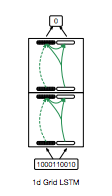

# 1D Grid LSTM on XOR problem 

Code in reference to [my post](http://christopher5106.github.io/deep/learning/2016/10/21/1d-grid-lstm-and-the-xor-problem.html)

As written in paper [Grid Long Short-Term Memory](https://arxiv.org/abs/1507.01526)

Working example on 10 bit input strings : 

		PATH=/usr/local/cuda-8.0-cudnn-4.0/bin:$PATH THEANO_FLAGS="device=gpu0,floatX=float32" python main.py --seq_length 10 --num_steps 10 --n_hidden 1000 --batch_size 20 --learning_rate 0.06
